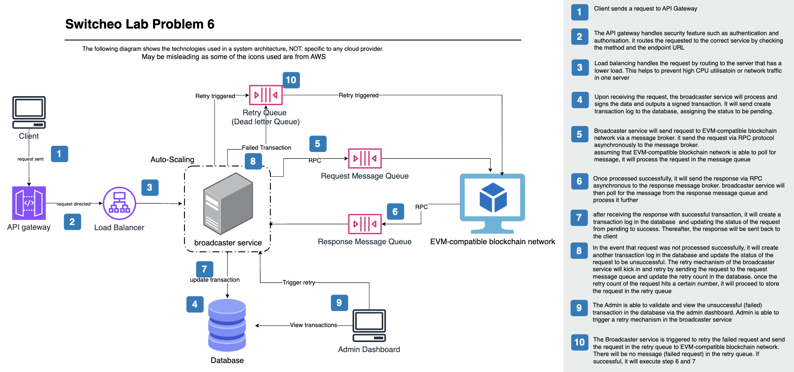

# Transaction Broadcaster Service Design

## Overview
The transaction broadcaster service is responsible for signing and broadcasting transactions to an EVM-compatible blockchain network. It ensures robustness through automatic retries, transaction persistence, and admin controls. This document details the software architecture and workflow for implementing this service.

---
## System Architecture

### Components
1. **API Gateway**: Handles incoming requests and routes them to the broadcaster service. Ensure secure authentication and authorisation before routing to service. It monitors access logs and provide versioning.
2. **Load Balancer**: Directs requests to the least busy broadcaster instance. Improve performance and lower latency
3. **Broadcaster Service**: Signs transactions, manages broadcasting logic, and retries failed transactions. Set up with **auto scaling** to scale up or down accordingly
4. **Message Queues**:
   - **Request Queue**: Handles asynchronous transaction broadcasting requests.
   - **Response Queue**: Handles responses from the blockchain network.
   - **Retry Queue**: Stores failed transactions for later retries.
5. **EVM-compatible Blockchain Node**: Receives signed transactions via RPC calls.
6. **Database**: Stores transaction logs, status, and retry information.
7. **Admin Dashboard**: Allows manual intervention and transaction monitoring.

### High-Level Flow
1. The **API Gateway** receives a `POST /transaction/broadcast` request.
2. The **Load Balancer** directs the request to an available broadcaster instance.
3. The **Broadcaster Service** extracts `data` from the request and signs it.
4. The signed transaction is added to the **Request Queue**.
5. The **Blockchain Node** polls messages from the queue and processes them.
6. The **Response Queue** receives the transaction response asynchronously.
7. If successful, the service updates the **Database** and marks the transaction as "Success".
8. If the transaction fails, it is logged as "Failed" and retried using the **Request Queue** again. After certain number of failed retries, it will be moved to the retry queue (dead letter queue)
9. The **Admin Dashboard** allows monitoring and manual retries of failed transactions.

##### *Do Refer to the sequence diagram attached for detailed sequence
---
## API Specification

### **POST /transaction/broadcast**
**Request Body:**
```json
{
  "message_type": "add_weight(address _addr, uint256 _weight)",
  "data": "0xd71363280000000000000000000000005eb715d601c2f27f83cb554b6b36e047822fb70a000000000000000000000000000000000000000000000000000000000000000fa"
}
```
**Response:**
- **200 OK**: The transaction is accepted for processing.
- **4xx/5xx**: Request validation or internal failure.

---
## Transaction Processing Logic

1. **Signing Transactions:**
   - The broadcaster service signs the data and outputs a signed transaction.
   - The signed transaction is structured as per EVM transaction format.
   - The request details are stored in the database so as to prevent fault tolerance when the broadcaster service restarts unexpectedly.

2. **Broadcasting to Blockchain:**
   - The signed transaction is added to the **Request Queue**.
   - The **Blockchain Node** polls the queue and processes the transaction.
   - The **Response Queue** asynchronously delivers transaction status.
   - Both the **Response Queue** and **Request Queue** are set to be persistent and durable to ensure data persistency and fault tolerance towards if the queues restart unexpectedly.
   

3. **Handling Responses:**
   - **Success Response** → Update database status to "Success".
   - **Failure Response** → Retry by sending **Retry Queue** again. Add to **Retry Queue** after limited number of retries.
   - **Timeout (1% cases, >30s)** → Retry by sending **Retry Queue** again. Add to **Retry Queue** after limited number of retries..

4. **Retries & Persistence:**
   - If a failure occurs, the service retries up to a maximum number of attempts.
   - The **Broadcaster Service** handles automatic retry attempts by sending to **Request Queue** and updating the **Database** regarding the number of retries. If exceed certain number of retries, it will be sent to the **Retry Queue**
   - The **Database** ensures transaction state persists across service(**Broadcaster Service**) restarts.

5. **Admin Dashboard Features:**
   - View transaction logs (Pending, Success, Failed).
   - Manually trigger retries for failed transactions.

---
## Database Schema

**Transactions Table:**
| Column | Type | Description |
|---|---|---|
| id | UUID | Unique transaction ID |
| message_type | String | Type of transaction |
| data | String | Raw transaction data |
| signed_transaction | String | Signed transaction data |
| status | Enum | (`Pending`, `Success`, `Failed`) |
| retries | Integer | Number of retries attempted |
| last_attempt | Timestamp | Last retry timestamp |

---
## Fault Tolerance & Scalability

### **Failure Handling**

- The **Broadcaster Service** ensures failed transactions are processed again by sending to **Request Queue** again. After certain number of retried, it is sent to **Retry Queue** for admin to process.
- The **Retry Queue** ensures failed transactions are processed again by the admin.
- Transactions are **processed asynchronously** to avoid blocking API requests(20-30s may be too long).


### **Scalability Considerations**
- **Load Balancing**: Requests are distributed to the least busy broadcaster instance.
- **Message Queues**: Decouple request handling from transaction processing.
- **Database Indexing**: Optimized query performance for transaction lookup.
- **Load Balancer** ensure the services do not run on workload such as high CPU or memory utilisation. It will distribute the load to servers with lower workload.
- **Auto Scaling group** for **Broadcaster Service** ensure that there will be enough servers to process the requests. Increase or decrease the number of server according to the metric set for the servers.

---
## Security Considerations
- **API Gateway** ensure secure authentication and authorisation and manage routing to services.
- **Rate Limiting**: Prevent spamming by enforcing rate limits on `POST /transaction/broadcast` using **API Gateway**.
- **Logging & Monitoring**: Maintain logs for debugging and integrate monitoring tools using **API Gateway**.

---
